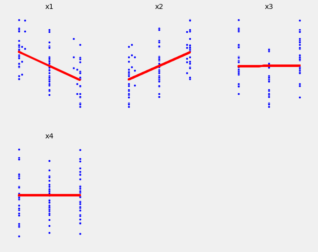
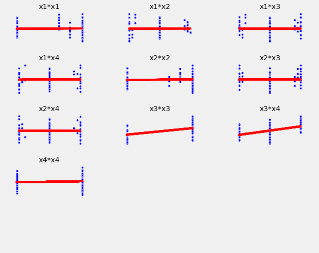
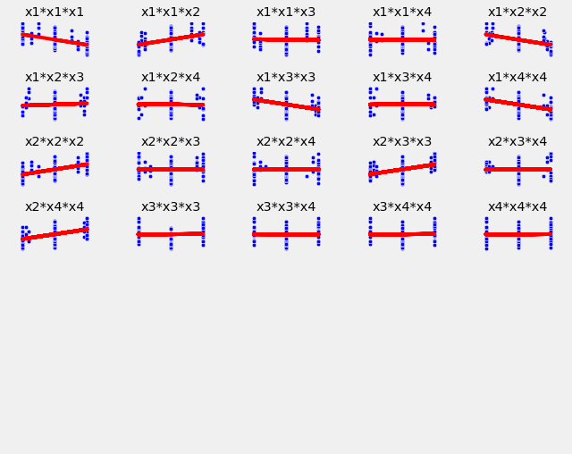
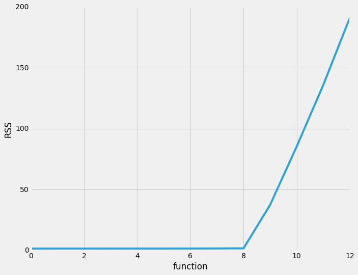
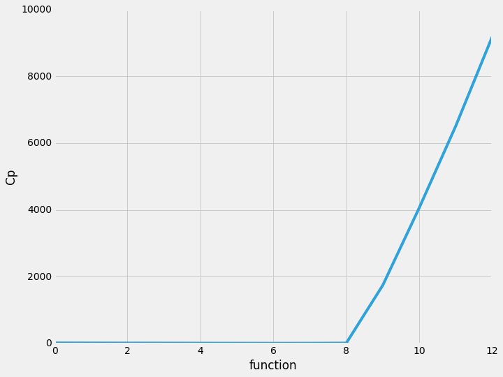
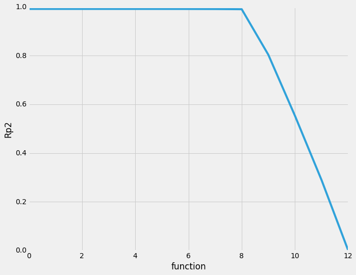
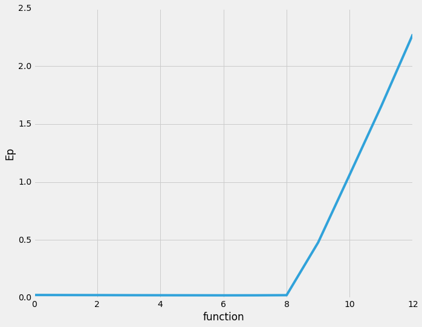
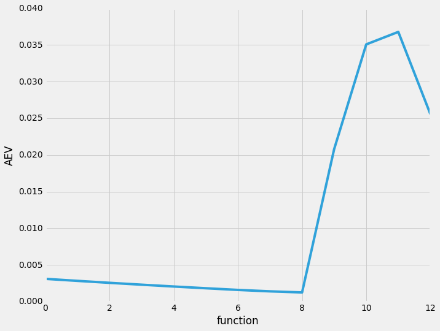
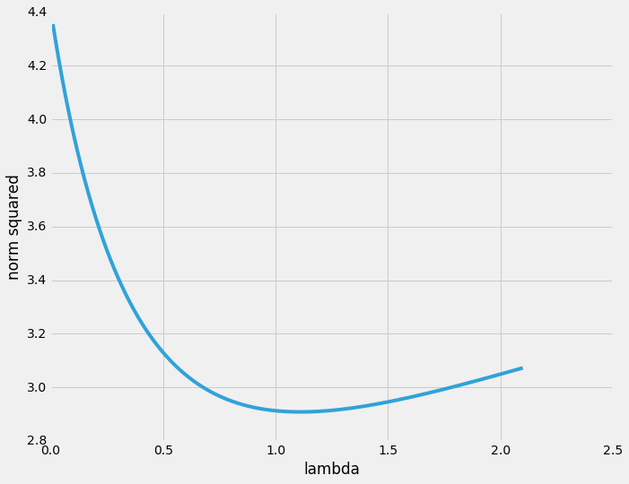
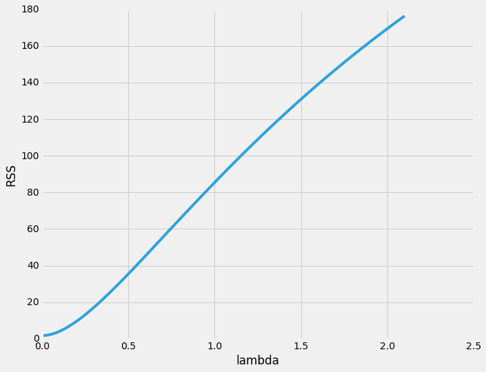

---
---

# Ход работы


```python
%matplotlib inline
from IPython.display import display, Math
import operator as op
import numpy as np
from scipy.stats import chi2
import scipy
import matplotlib as mpl
import matplotlib.pyplot as plt
from tabipy import Table, TableHeaderRow
mpl.style.use('fivethirtyeight')
mpl.rcParams.update({'font.size': 10})
mpl.rcParams.update({'figure.figsize': [10, 8]})
```


```python
data = [
    [-0.9,-1,-1,-1,3.38],
    [-0.9,-1,-1,0,2.27],
    [-0.9,-1,-1,1,1.30],
    [-1,-1,0,-1,1.20],
    [-1,-1,0,0,0.99],
    [-1,-1,0,1,1.00],
    [-1,-0.9,1,-1,1.87],
    [-1,-0.9,1,0,2.75],
    [-1,-0.9,1,1,3.52],
    [-1,0,-1,-1,4.73],
    [-1,0,-1,0,3.36],
    [-1,0,-1,1,2.64],
    [-1,0,0,-1,2.09],
    [-1,0,0,0,1.92],
    [-1,0,0,1,2.14],
    [-1,0,1,-1,2.54],
    [-1,0,1,0,3.82],
    [-1,0,1,1,4.64],
    [-1,1,-1,-1,5.36],
    [-1,1,-1,0,4.52],
    [-1,1,-1,1,3.49],
    [-1,1,0,-1,3.21],
    [-1,1,0,0,3.05],
    [-1,1,0,1,3.16],
    [-0.8,1,1,-1,3.22],
    [-0.8,1,1,0,4.52],
    [-0.8,1,1,1,5.31],
    [0,-0.8,-1,-1,2.60],
    [0,-0.8,-1,0,1.60],
    [0,-0.8,-1,1,0.49],
    [0,-1,0,-1,-0.18],
    [0,-1,0,0,0.11],
    [0,-1,0,1,0.17],
    [0,-1,1,-1,0.60],
    [0,-1,1,0,1.42],
    [0,-1,1,1,2.59],
    [0,0,-1,-1,3.41],
    [0,0,-1,0,2.35],
    [0,0,-1,1,1.87],
    [0,0,0,-1,0.85],
    [0,0,0,0,1.03],
    [0,0,0,1,0.82],
    [0,0,1,-1,1.64],
    [0,0,1,0,2.40],
    [0,0,1,1,3.71],
    [0,1,-1,-1,4.61],
    [0,1,-1,0,3.35],
    [0,1,-1,1,2.27],
    [0,1,0,-1,1.85],
    [0,1,0,0,2.11],
    [0,1,0,1,1.82],
    [0,0.9,1,-1,2.51],
    [0,0.9,1,0,3.29],
    [0,0.9,1,1,4.47],
    [0.9,-1,-1,-1,1.68],
    [0.9,-1,-1,0,0.60],
    [0.9,-1,-1,1,-0.11],
    [1,-1,0,-1,-1.09],
    [1,-1,0,0,-0.83],
    [1,-1,0,1,-0.89],
    [1,-1,1,-1,-0.38],
    [1,-1,1,0,0.48],
    [1,-1,1,1,1.49],
    [1,0,-1,-1,2.56],
    [1,0,-1,0,1.55],
    [1,0,-1,1,0.44],
    [1,0,0,-1,-0.33],
    [1,0,0,0,-0.33],
    [1,0,0,1,-0.13],
    [1,0,1,-1,0.46],
    [1,0,1,0,1.43],
    [1,0,1,1,2.45],
    [1,0.9,-1,-1,3.51],
    [1,0.9,-1,0,2.25],
    [1,0.9,-1,1,1.44],
    [1,1,0,-1,0.98],
    [1,1,0,0,1.00],
    [1,1,0,1,1.09],
    [0.8,1,1,-1,1.79],
    [0.8,1,1,0,2.59],
    [0.8,1,1,1,3.95],
    [0,0,0,0,1.19],
    [0,0,0,0,0.79],
    [0,0,0,0,0.94],
    [0,0,0,0,0.93],
    [0,0,0,0,1.05],
    [0,0,0,0,1.10]
]

def fl(f):
    return '{:.5}'.format(f)

def fls(ff):
    return [fl(f) for f in ff]

def mat_X(xs, fs_):
    return np.matrix([[f(x) for f in fs_] for x in xs])

def approx_th(X, ys):
    return ((X.T*X).I)*X.T*ys

def rss(Y, X, Th):
    return ((Y - X*Th).T*(Y - X*Th)).item(0)
```

## Корелляционные поля


```python
def plotem(xss, ys, xlabs, ylab, shape, hspace=0.3):
    fig, axs = plt.subplots(*shape)
    axs = [it for l in axs for it in l]
    for i in xrange(len(xss)):
        xs = xss[i]
        ax = axs[i]
        xlab = xlabs[i]
        fit = np.polyfit(xs, ys, deg=1)
        ax.plot(xs, fit[0] * xs + fit[1], color='red')
        ax.scatter(xs, ys)
        ax.set_title(xlab)
        ax.set_xticks([])
        ax.set_yticks([])
        #ax.ylabel(ylab)
    for ax in axs:
        ax.set_xticks([])
        ax.set_yticks([])
    fig.subplots_adjust(hspace=hspace)
    fig.show()
    #plt.close(fig)

data = np.array(data).T
labs = ['x'+str(i+1) for i in xrange(5)]
plotem(data[:-1], data[-1], labs, 'y', (2,3), 0.2)

labs = []
d = []
for i in xrange(4):
    for j in xrange(i,4):
        labs.append('x{}*x{}'.format(i+1, j+1))
        d.append(data[i]*data[j])
plotem(d, data[-1], labs, 'y', (5,3), 0.5)

labs = []
d = []
for i in xrange(4):
    for j in xrange(i,4):
        for k in xrange(j,4):
            labs.append('x{}*x{}*x{}'.format(i+1, j+1, k+1))
            d.append(data[i]*data[j]*data[k])
plotem(d, data[-1], labs, 'y', (7,5), 0.7)
```

    /home/giraff/.local/lib/python2.7/site-packages/matplotlib/figure.py:397: UserWarning: matplotlib is currently using a non-GUI backend, so cannot show the figure
      "matplotlib is currently using a non-GUI backend, "











Предварительный состав регрессоров: $x_1,x_2,x_3^2,x_3x_4,x_1^3,x_1^2x_2.x_1x_2^2,x_1x_3^2,x_1x_4^2,x_2^3,x_2x_3^2,x_2x_4^2$.

## Выбор модели оптимальной сложности


```python
ps = np.array(data.T)
ys = np.matrix(ps[:,-1]).T
xs = [p[:-1].tolist() for p in ps]

def F_criterion(X, X_):
    th = approx_th(X, ys)
    th_ = approx_th(X_, ys)
    r = rss(ys, X, th)
    r_ = rss(ys, X_, th_)
    return op.sub(*X.shape)**-1*(r_-r)/r_ if op.sub(*X.shape) != 0 else 10e30
```


```python
from copy import deepcopy

fs = [
    (lambda x: 1., '1'),
    (lambda x: x[0], 'x_1'),
    (lambda x: x[1], 'x_2'),
    (lambda x: x[2]**2, 'x_3^2'),
    (lambda x: x[2]*x[3], 'x_3x_4'),
    (lambda x: x[0]**3, 'x_1^3'),
    (lambda x: x[0]**2*x[1], 'x_1^2x_2'),
    (lambda x: x[0]*x[1]**2, 'x_1x_2^2'),
    (lambda x: x[0]*x[2]**2, 'x_1x_3^2'),
    (lambda x: x[0]*x[3]**2, 'x_1x_4^2'),
    (lambda x: x[1]**3, 'x_2^3'),
    (lambda x: x[1]*x[2]**2, 'x_2x_3^2'),
    (lambda x: x[1]*x[3]**2, 'x_2x_4^2')
]

models = [deepcopy(fs)]
while len(models[-1]) > 1:
    X = mat_X(xs, zip(*models[-1])[0])
    Fc = [F_criterion(X, X_)
        for X_ in [mat_X(xs, zip(*np.delete(models[-1], i, axis=0))[0])
            for i in xrange(len(models[-1]))]]
    models.append(np.delete(models[-1], Fc.index(min(Fc[1:])), axis=0))
```


```python
from IPython.core.interactiveshell import InteractiveShell
InteractiveShell.ast_node_interactivity = "all"

def bareRSS(m):
    X = mat_X(xs, zip(*m)[0])
    return rss(ys, X, approx_th(X, ys))

def malous(m_init, m):
    X_init = mat_X(xs, zip(*m_init)[0])
    sigm = rss(ys, X_init, approx_th(X_init, ys))/float(op.sub(*X_init.shape))
    X = mat_X(xs, zip(*m)[0])
    return rss(ys, X, approx_th(X, ys))/sigm + 2*len(m) - len(ys)

def determ(m):
    if m[0][1] != '1': return None
    X = mat_X(xs, zip(*m)[0])
    th = approx_th(X, ys).T.tolist()[0]
    Y = [sum([f(x)*t for (f, t) in zip(zip(*m)[0], th)]) for x in xs]
    Y_m = np.mean(Y)
    ys_m = np.mean(ys)
    return sum([(y - Y_m)**2 for y in Y])/sum([(y - ys_m)**2 for y in ys]).item(0)

def msep(m):
    X = mat_X(xs, zip(*m)[0])
    r = rss(ys, X, approx_th(X, ys))
    n, p = X.shape
    return (r*(1 + n + (p*(n+1))/(n-p-2)))/(n*(n-p)) if n-p-2 != 0 and n-p != 0 else None

def AEV_criterion(m):
    X = mat_X(xs, zip(*m)[0])
    r = rss(ys, X, approx_th(X, ys))
    n, p = X.shape
    return (p*r)/(n*(n-p)) if n-p != 0 else None

m_repr = [' + '.join([f[1] for f in m]) for m in models]
rsses = [bareRSS(m) for m in models]
cp = [malous(fs, m) for m in models]
rp2 = [determ(m) for m in models]
ep = [msep(m) for m in models]
aev = [AEV_criterion(m) for m in models]

Table(
    #TableHeaderRow('Model', 'Malous', 'Coefficient of determination'),
    TableHeaderRow('#', 'Model', 'RSS', 'C_p', 'R_p^2', 'E_p', 'AEV'),
    *np.transpose([list(range(len(m_repr))), m_repr, fls(rsses), fls(cp), fls(rp2), fls(ep), fls(aev)])
)
```


<table>
<tr><th >#</th><th >Model</th><th >RSS</th><th >C_p</th><th >R_p^2</th><th >E_p</th><th >AEV</th></tr>
<tr><td >0</td><td >1 + x_1 + x_2 + x_3^2 + x_3x_4 + x_1^3 + x_1^2x_2 + x_1x_2^2 + x_1x_3^2 + x_1x_4^2 + x_2^3 + x_2x_3^2 + x_2x_4^2</td><td >1.5276</td><td >13.0</td><td >0.99201</td><td >0.02444</td><td >0.0030847</td></tr>
<tr><td >1</td><td >1 + x_1 + x_2 + x_3^2 + x_3x_4 + x_1^3 + x_1^2x_2 + x_1x_2^2 + x_1x_3^2 + x_1x_4^2 + x_2^3 + x_2x_3^2</td><td >1.5277</td><td >11.006</td><td >0.99201</td><td >0.023882</td><td >0.0028097</td></tr>
<tr><td >2</td><td >1 + x_1 + x_2 + x_3^2 + x_3x_4 + x_1^3 + x_1^2x_2 + x_1x_2^2 + x_1x_3^2 + x_1x_4^2 + x_2^3</td><td >1.5286</td><td >9.0493</td><td >0.99201</td><td >0.02335</td><td >0.0025431</td></tr>
<tr><td >3</td><td >1 + x_1 + x_2 + x_3^2 + x_3x_4 + x_1^3 + x_1x_2^2 + x_1x_3^2 + x_1x_4^2 + x_2^3</td><td >1.5319</td><td >7.2072</td><td >0.99199</td><td >0.022639</td><td >0.0022868</td></tr>
<tr><td >4</td><td >1 + x_1 + x_2 + x_3^2 + x_3x_4 + x_1^3 + x_1x_2^2 + x_1x_3^2 + x_2^3</td><td >1.5381</td><td >5.5076</td><td >0.99196</td><td >0.022213</td><td >0.0020399</td></tr>
<tr><td >5</td><td >1 + x_1 + x_2 + x_3^2 + x_3x_4 + x_1x_2^2 + x_1x_3^2 + x_2^3</td><td >1.5486</td><td >4.018</td><td >0.9919</td><td >0.021856</td><td >0.0018026</td></tr>
<tr><td >6</td><td >1 + x_1 + x_2 + x_3^2 + x_3x_4 + x_1x_2^2 + x_1x_3^2</td><td >1.565</td><td >2.8089</td><td >0.99182</td><td >0.021361</td><td >0.001574</td></tr>
<tr><td >7</td><td >1 + x_1 + x_2 + x_3^2 + x_3x_4 + x_1x_2^2</td><td >1.6202</td><td >3.4858</td><td >0.99153</td><td >0.021612</td><td >0.0013795</td></tr>
<tr><td >8</td><td >1 + x_1 + x_2 + x_3^2 + x_3x_4</td><td >1.7556</td><td >8.0423</td><td >0.99082</td><td >0.022886</td><td >0.0012304</td></tr>
<tr><td >9</td><td >1 + x_1 + x_2 + x_3^2</td><td >37.536</td><td >1739.3</td><td >0.80378</td><td >0.47823</td><td >0.020793</td></tr>
<tr><td >10</td><td >1 + x_1 + x_2</td><td >85.476</td><td >4059.6</td><td >0.55318</td><td >1.0644</td><td >0.035089</td></tr>
<tr><td >11</td><td >1 + x_1</td><td >136.05</td><td >6507.2</td><td >0.28884</td><td >1.6557</td><td >0.036794</td></tr>
<tr><td >12</td><td >1</td><td >191.3</td><td >9181.7</td><td >3.5876e-31</td><td >2.2755</td><td >0.025568</td></tr>
</table>


```python
import matplotlib as mpl
import matplotlib.pyplot as plt
mpl.style.use('fivethirtyeight')

def draw(title, lst):
    plt.xlabel('function')
    plt.ylabel(title)
    plt.plot(list(range(len(lst))), lst)
    plt.show()
    
draw('RSS', rsses)
draw('Cp', cp)
draw('Rp2', rp2)
draw('Ep', ep)
draw('AEV', aev)
```

















По большинству критериев оптимальной признаётся модель №8 с регрессорами $1, x_1, x_2, x_3^2, x_3x_4$.


```python
m_opt = zip(*models[8])[0]
X_opt = mat_X(xs, m_opt)
th_opt = approx_th(X_opt, ys)
display(Math(r'\hat{\theta}=('+','.join(fls(th_opt.T.tolist()[0]))+')'))

ys_hat = np.matrix([[r(x) for r in m_opt] for x in xs])*th_opt
Table(TableHeaderRow('y', 'y*', 'y-y*'), *np.transpose(
    [fls(ys.T.tolist()[0]), fls(ys_hat.T.tolist()[0]), fls((ys-ys_hat).T.tolist()[0])]
))
```


$$\hat{\theta}=(0.99424,-1.0322,0.9904,1.5299,0.99694)$$


<table>
<tr><th >y</th><th >y*</th><th >y-y*</th></tr>
<tr><td >3.38</td><td >3.4597</td><td >-0.079673</td></tr>
<tr><td >2.27</td><td >2.4627</td><td >-0.19273</td></tr>
<tr><td >1.3</td><td >1.4658</td><td >-0.16578</td></tr>
<tr><td >1.2</td><td >1.0361</td><td >0.16393</td></tr>
<tr><td >0.99</td><td >1.0361</td><td >-0.046066</td></tr>
<tr><td >1.0</td><td >1.0361</td><td >-0.036066</td></tr>
<tr><td >1.87</td><td >1.668</td><td >0.20195</td></tr>
<tr><td >2.75</td><td >2.665</td><td >0.085009</td></tr>
<tr><td >3.52</td><td >3.6619</td><td >-0.14194</td></tr>
<tr><td >4.73</td><td >4.5533</td><td >0.1767</td></tr>
<tr><td >3.36</td><td >3.5564</td><td >-0.19635</td></tr>
<tr><td >2.64</td><td >2.5594</td><td >0.080593</td></tr>
<tr><td >2.09</td><td >2.0265</td><td >0.063534</td></tr>
<tr><td >1.92</td><td >2.0265</td><td >-0.10647</td></tr>
<tr><td >2.14</td><td >2.0265</td><td >0.11353</td></tr>
<tr><td >2.54</td><td >2.5594</td><td >-0.019407</td></tr>
<tr><td >3.82</td><td >3.5564</td><td >0.26365</td></tr>
<tr><td >4.64</td><td >4.5533</td><td >0.086704</td></tr>
<tr><td >5.36</td><td >5.5437</td><td >-0.1837</td></tr>
<tr><td >4.52</td><td >4.5468</td><td >-0.026752</td></tr>
<tr><td >3.49</td><td >3.5498</td><td >-0.059808</td></tr>
<tr><td >3.21</td><td >3.0169</td><td >0.19313</td></tr>
<tr><td >3.05</td><td >3.0169</td><td >0.033133</td></tr>
<tr><td >3.16</td><td >3.0169</td><td >0.14313</td></tr>
<tr><td >3.22</td><td >3.3434</td><td >-0.12336</td></tr>
<tr><td >4.52</td><td >4.3403</td><td >0.17969</td></tr>
<tr><td >5.31</td><td >5.3373</td><td >-0.027252</td></tr>
<tr><td >2.6</td><td >2.7288</td><td >-0.12875</td></tr>
<tr><td >1.6</td><td >1.7318</td><td >-0.13181</td></tr>
<tr><td >0.49</td><td >0.73486</td><td >-0.24486</td></tr>
<tr><td >-0.18</td><td >0.0038416</td><td >-0.18384</td></tr>
<tr><td >0.11</td><td >0.0038416</td><td >0.10616</td></tr>
<tr><td >0.17</td><td >0.0038416</td><td >0.16616</td></tr>
<tr><td >0.6</td><td >0.53678</td><td >0.063218</td></tr>
<tr><td >1.42</td><td >1.5337</td><td >-0.11373</td></tr>
<tr><td >2.59</td><td >2.5307</td><td >0.059329</td></tr>
<tr><td >3.41</td><td >3.5211</td><td >-0.11107</td></tr>
<tr><td >2.35</td><td >2.5241</td><td >-0.17413</td></tr>
<tr><td >1.87</td><td >1.5272</td><td >0.34282</td></tr>
<tr><td >0.85</td><td >0.99424</td><td >-0.14424</td></tr>
<tr><td >1.03</td><td >0.99424</td><td >0.035758</td></tr>
<tr><td >0.82</td><td >0.99424</td><td >-0.17424</td></tr>
<tr><td >1.64</td><td >1.5272</td><td >0.11282</td></tr>
<tr><td >2.4</td><td >2.5241</td><td >-0.12413</td></tr>
<tr><td >3.71</td><td >3.5211</td><td >0.18893</td></tr>
<tr><td >4.61</td><td >4.5115</td><td >0.098527</td></tr>
<tr><td >3.35</td><td >3.5145</td><td >-0.16453</td></tr>
<tr><td >2.27</td><td >2.5176</td><td >-0.24758</td></tr>
<tr><td >1.85</td><td >1.9846</td><td >-0.13464</td></tr>
<tr><td >2.11</td><td >1.9846</td><td >0.12536</td></tr>
<tr><td >1.82</td><td >1.9846</td><td >-0.16464</td></tr>
<tr><td >2.51</td><td >2.4185</td><td >0.091456</td></tr>
<tr><td >3.29</td><td >3.4155</td><td >-0.12549</td></tr>
<tr><td >4.47</td><td >4.4124</td><td >0.057567</td></tr>
<tr><td >1.68</td><td >1.6017</td><td >0.078331</td></tr>
<tr><td >0.6</td><td >0.60472</td><td >-0.0047249</td></tr>
<tr><td >-0.11</td><td >-0.39222</td><td >0.28222</td></tr>
<tr><td >-1.09</td><td >-1.0284</td><td >-0.061618</td></tr>
<tr><td >-0.83</td><td >-1.0284</td><td >0.19838</td></tr>
<tr><td >-0.89</td><td >-1.0284</td><td >0.13838</td></tr>
<tr><td >-0.38</td><td >-0.49544</td><td >0.11544</td></tr>
<tr><td >0.48</td><td >0.5015</td><td >-0.021503</td></tr>
<tr><td >1.49</td><td >1.4984</td><td >-0.0084469</td></tr>
<tr><td >2.56</td><td >2.4888</td><td >0.071152</td></tr>
<tr><td >1.55</td><td >1.4919</td><td >0.058097</td></tr>
<tr><td >0.44</td><td >0.49496</td><td >-0.054959</td></tr>
<tr><td >-0.33</td><td >-0.037982</td><td >-0.29202</td></tr>
<tr><td >-0.33</td><td >-0.037982</td><td >-0.29202</td></tr>
<tr><td >-0.13</td><td >-0.037982</td><td >-0.092018</td></tr>
<tr><td >0.46</td><td >0.49496</td><td >-0.034959</td></tr>
<tr><td >1.43</td><td >1.4919</td><td >-0.061903</td></tr>
<tr><td >2.45</td><td >2.4888</td><td >-0.038848</td></tr>
<tr><td >3.51</td><td >3.3802</td><td >0.12979</td></tr>
<tr><td >2.25</td><td >2.3833</td><td >-0.13326</td></tr>
<tr><td >1.44</td><td >1.3863</td><td >0.05368</td></tr>
<tr><td >0.98</td><td >0.95242</td><td >0.027581</td></tr>
<tr><td >1.0</td><td >0.95242</td><td >0.047581</td></tr>
<tr><td >1.09</td><td >0.95242</td><td >0.13758</td></tr>
<tr><td >1.79</td><td >1.6918</td><td >0.098195</td></tr>
<tr><td >2.59</td><td >2.6887</td><td >-0.098749</td></tr>
<tr><td >3.95</td><td >3.6857</td><td >0.26431</td></tr>
<tr><td >1.19</td><td >0.99424</td><td >0.19576</td></tr>
<tr><td >0.79</td><td >0.99424</td><td >-0.20424</td></tr>
<tr><td >0.94</td><td >0.99424</td><td >-0.054242</td></tr>
<tr><td >0.93</td><td >0.99424</td><td >-0.064242</td></tr>
<tr><td >1.05</td><td >0.99424</td><td >0.055758</td></tr>
<tr><td >1.1</td><td >0.99424</td><td >0.10576</td></tr>
</table>


## Проверка на мультиколлинеарность

### Определитель информационной матрицы


```python
X = mat_X(xs, m_opt)
det = np.linalg.det(X.T*X)
#det = reduce(op.mul, np.linalg.eig(X.T*X)[0], 1)

display(Math(r'|X^TX|='+fl(det)))
display(Math(r'\left|\frac{X^TX}{tr(X^TX)}\right|='+fl(np.linalg.det((X.T*X)/(X.T*X).trace()))))
```


$$|X^TX|=1.6653e+08$$


$$\left|\frac{X^TX}{tr(X^TX)}\right|=9.8668e-05$$


### Минимальное собственное значение информационной матрицы


```python
eig = np.linalg.eig(X.T*X)[0]
display(Math(r'\lambda\min(X^TX)=' + fl(min(eig))))
```


$$\lambda\min(X^TX)=14.035$$


### Мера обусловленности матрицы по Нейману-Голдстейну


```python
display(Math(r'\frac{\lambda_{max}}{\lambda_{min}}=' + fl(max(eig)/min(eig))))
```


$$\frac{\lambda_{max}}{\lambda_{min}}=9.0463$$


### Максимальная парная сопряжённость


```python
norm = np.linalg.norm

XT = X.T
m = len(xs[0])
R = [[((XT[i,:]*XT[j,:].T)/(norm(XT[i,:])*norm(XT[j,:]))).item(0) for j in xrange(m)] for i in xrange(m)]
print 'Матрица R:'
Table(*[fls(r) for r in R])
```

    Матрица R:


<table>
<tr><td >1.0</td><td >-8.3583e-17</td><td >0.0044945</td><td >0.78784</td></tr>
<tr><td >-8.3583e-17</td><td >1.0</td><td >-0.011775</td><td >-3.8193e-17</td></tr>
<tr><td >0.0044945</td><td >-0.011775</td><td >1.0</td><td >0.0057049</td></tr>
<tr><td >0.78784</td><td >-3.8193e-17</td><td >0.0057049</td><td >1.0</td></tr>
</table>


```python
mut_conj = sorted([abs(r) for r in np.ravel(R)], reverse=True)[m:][0]

print 'Показатель мультиколлинеарности:'
display(Math(r'\max_{i,j;i\not=j}|r_{i,j}|=' + fl(mut_conj)))
```

    Показатель мультиколлинеарности:


$$\max_{i,j;i\not=j}|r_{i,j}|=0.78784$$


### Максимальная сопряжённость


```python
conj = [(1. - r**-1)**.5 for r in (np.matrix(R)**-1).diagonal().tolist()[0]]
display(Math(r'R=('+','.join(fls(conj))+')'))
display(Math(r'\max|R_i|='+fl(max([abs(c) for c in conj]))))
```


$$R=(0.78784,0.011775,0.013084,0.78784)$$


$$\max|R_i|=0.78784$$


Присутствует эффект мультиколлинеарности.

## Проверка на гетероскедастичность

### Тест Бреуша-Пагана


```python
theta = ((X.T*X).I)*X.T*ys
display(Math(r'\hat{\theta}=('+','.join([fl(t) for t in theta.T.tolist()[0]])+')'))
```


$$\hat{\theta}=(0.99424,-1.0322,0.9904,1.5299,0.99694)$$


```python
e = ys - X*theta
sigm = (e.T*e / X.shape[0]).item(0)
display(Math(r'\hat{\sigma}^2='+fl(sigm)))
```


$$\hat{\sigma}^2=0.020179$$


```python
import patsy as pt
# построение вспомогательной регрессии с помощью patsy & numpy
aux_reg = {
    'z1': [x[0]**2 for x in xs],
    'z2': [x[1]**2 for x in xs],
    'z3': [x[2]**2 for x in xs],
    'z4': [x[3]**2 for x in xs],
    'c': [et**2 / sigm for et in e.T.tolist()[0]]
}
# `1 +` is optional since patsy handles implicitly
pt_c, pt_z = pt.dmatrices("c ~ 1 + z1 + z2 + z3 + z4", aux_reg)
res = np.linalg.lstsq(pt_z, pt_c)
alpha = np.matrix(res[0])

display(Math(r'\hat{\alpha}=('+','.join([fl(a) for a in alpha.T.tolist()[0]])+')'))
```


$$\hat{\alpha}=(1.1745,-0.25956,-0.24506,0.0039801,0.19103)$$


```python
c_appr = [alpha.T * np.matrix(
    [1, aux_reg['z1'][i], aux_reg['z2'][i], aux_reg['z3'][i], aux_reg['z4'][i]]
).T for i in xrange(len(aux_reg['z1']))]
c_appr = [c.item(0) for c in c_appr]
c_mean = np.mean(aux_reg['c'])
ess = sum([(c - c_mean)**2 for c in c_appr])
St = ess/2.
S = chi2.ppf(.95,4)

display(Math(r'\frac{ESS}{2}='+fl(St)+('>' if St > S else '<')+r'\chi^2_1='+fl(S)))
```


$$\frac{ESS}{2}=1.4617<\chi^2_1=9.4877$$


Следовательно, нет оснований для отвержения гипотезы о гомоскедастичности возмущений.

### Тест Голдфельда-Квандтона


```python
rss = lambda Y, X, Th: ((Y - X*Th).T*(Y - X*Th)).item(0)

xs_srt = sorted(xs, key=lambda x: x[0]**2)
nc = len(xs)/3
xs_head = xs[:nc]
xs_tail = xs[-nc:]
ys_head = ys[:nc]
ys_tail = ys[-nc:]

Xh = mat_X(xs_head, m_opt)
Xt = mat_X(xs_tail, m_opt)

th_h = ((Xh.T*Xh).I)*Xh.T*ys_head
th_t = ((Xt.T*Xt).I)*Xt.T*ys_tail

St = rss(ys_tail, Xt, th_t)/rss(ys_head, Xh, th_h)
S = scipy.stats.f.ppf(.95, nc-len(m_opt), nc-len(m_opt))

display(Math(r'\frac{RSS_2}{RSS_1}='+fl(St)+('>' if St > S else '<')+r'F='+fl(S)))
```


$$\frac{RSS_2}{RSS_1}=1.1143<F=1.9838$$


Следовательно, нет оснований для отвержения гипотезы о гомоскедастичности возмущений.

Можно считать, что гетероскедастичность отсутствует.

## Проверка на автокорелляцию

### Тест Дарбина-Уотсона


```python
theta = ((X.T*X).I)*X.T*ys
e = ys - X*theta

St = sum([(e.item(t) - e.item(t-1))**2 for t in xrange(1,e.shape[0])]) \
    / sum([e.item(t)**2 for t in xrange(e.shape[0])])
    
display(Math(r'DW={}'.format(fl(St))))
```


$$DW=2.0432$$


$DW$ близко к 2, следовательно можно считать, что автокорелляция отсутствует.

## Проверка адекватности полученной модели

Для получения оценки вектора $\theta$ воспользуемся ридж-оценкой.


```python
rss = lambda Y, X, Th: ((Y - X*Th).T*(Y - X*Th)).item(0)

def ridge(l, X, Y):
    n = X.shape[1]
    L = np.identity(n)
    for i in xrange(n):
        L[i][i] = l*(X.T*X).item(i, i)
    #return ((X.T*X + L)**-1*X.T*Y).T.tolist()[0]
    return (X.T*X + L)**-1*X.T*Y

ns = []
rsses = []
ls = np.arange(.01, 2.101, .001)
for l in ls:
    th = np.matrix([1] * len(m_opt)).T
    th_ = ridge(l, X, np.matrix(ys))
    ns.append(norm(th - th_)**2)
    rsses.append(rss(np.matrix(ys), X, th_))
    
plt.plot(ls, ns); plt.xlabel('lambda'); plt.ylabel('norm squared'); plt.show()
plt.plot(ls, rsses); plt.xlabel('lambda'); plt.ylabel('RSS'); plt.show()
```


    [<matplotlib.lines.Line2D at 0x7f6ed23340d0>]


    <matplotlib.text.Text at 0x7f6ed1d9bf90>


    <matplotlib.text.Text at 0x7f6ed3cddc90>





    [<matplotlib.lines.Line2D at 0x7f6ed3bf0290>]


    <matplotlib.text.Text at 0x7f6ed3adf8d0>


    <matplotlib.text.Text at 0x7f6ed3af9ad0>





```python
theta = ridge(1.1, X, np.matrix(ys))
final_rss = rss(np.matrix(ys), X, final_th)
display(Math(r'\hat{\theta}=('+','.join([fl(th) for th in final_th.T.tolist()[0]])+')'))
display(Math(r'RSS='+fl(final_rss)))

#ys_hat = np.matrix([[r(x) for r in m_opt] for x in xs])*theta
#Table(TableHeaderRow('y', 'y*', 'y-y*'), *np.transpose(
#    [fls(ys.T.tolist()[0]), fls(ys_hat.T.tolist()[0]), fls((ys-ys_hat).T.tolist()[0])]
#))
```


$$\hat{\theta}=(0.64274,-0.47207,0.45589,0.85652,0.45316)$$


$$RSS=104.42$$

