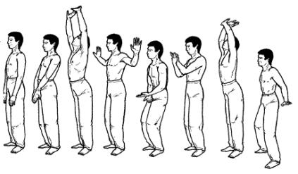

**Исходное положение:** ноги вместе, плечи слегка отведены назад, руки свободно
опущены вдоль тела, ладони касаются бедер.

Начинаем вдох нижней частью живота, при этом плечи, подаваясь вперед, сдавливают
верхнюю часть грудной клетки, препятствуя ее расширению; мышцы ягодиц поджимаются.
Ладони, поворачиваясь наружу, внизу перед телом соединяются тыльной
поверхностью. Руки медленно поднимаем вверх, освобождая грудную клетку,
способствуя заполнению при вдохе средней и верхней части легких. Одновременно с
руками поднимаем вверх голову, глазами следим за кистями рук. При движении рук в
крайнее верхнее положение важно ощутить мягкое потягивающее движение всего тела
вверх, не лишенное определенной приятности. Пятки от пола не отрывать.

Повторить 3 раза.
