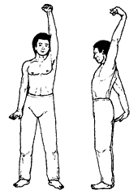

# Почешите плечо ухом



**Исходное положение:** ноги на ширине плеч, правая рука поднята вверх, кисть
свободно свисает, левая рука опущена вниз, кисть ее максимально отогнута вверх,
ладонь повернута вниз, пальцы обеих рук слегка расставлены.

На вдохе два раза отводим руки максимально назад. Затем меняем их положение и на
выдохе повторяем махи руками. При выполнении упражнения руки в локтях не
сгибать, а «верхнюю» руку максимально приблизить к голове так, чтобы при взмахе
касаться уха.

Делая махи руками, важно сосредоточить внимание на концентрации напряжения в
области лучезапястных суставов.

Повторить 7 раз.

***

**Next up:** [Руки толкают небо](../01) -> [Змея в танце](../04).
