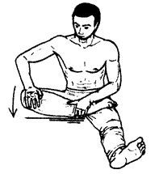

# Кольцо змеи

**Исходное положение:** Левая нога вытянута вперед, правая согнута в колене,
правая стопа подъемом лежит на левом бедре, подошва максимально повернута вверх.
Левой рукой придерживаем щиколотку правой ноги, правой ладонью опираемся на
правый коленный сустав.

Пружинистым движением на выдохе прижимаем правое колено к полу.

Повторяем упражнение 7 раз.

***

**Next up:** [Дракон прикрывается крылом](../08-dragon-wing).
