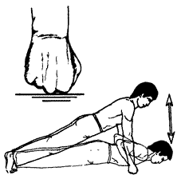

# Руки толкают землю



**Исходное положение:** В упоре на вытянутых руках, руки на ширине плеч; кисти
сжаты в кулаки и упираются в пол костяшками указательного и среднего пальцев,
подушечки пальцев ног упираются в пол.

На выдохе сгибаем руки в локтях и касаемся грудью пола. На вдохе – отжимаемся от
пола в исходное положение. При выполнении упражнения корпус должен быть прямым.

Повторяем 10-15 раз.

***

**Next up:** [Дракон приподнимает голову](../16).
