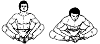

# Двойное кольцо змеи

**Исходное положение:** В положении сидя, ноги согнуты в коленях, колени
расставлены, стопы соприкасаются. Руки обхватывают одноименные лодыжки ног,
предплечьями упираемся в голени. Смотрим на стопы.

На выдохе, наклоняясь корпусом вперед, отжимаем предплечьями голени вниз,
стремясь прижать их к полу. На вдохе возвращаемся в исходное положение.
Старайтесь держать спину прямой.

Повторяем 7 раз.

***

**Next up:** [Тростник раскачивается на ветру](../18).
