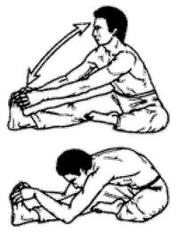

# Сломанный ветром тростник



**Исходное положение:** Аналогичное [предыдущему упражнению](../18), однако
правая нога согнута в колене и касается подошвой левого бедра с внутренней
стороны.

На выдохе выполняем наклоны к левой ноге на 8 счетов, чередуя выдох и вдох.
(Полностью распрямляться не рекомендуется.) Затем меняем положение ног и
выполняем наклоны к правой ноге.

***

**Next up:** [Удав заглатывает птицу](../20).
