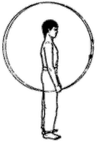

# Журавль перед разбегом



**Исходное положение:** Стоим, ноги на ширине плеч, руки опущены вдоль тела,
кулаки сжаты.

Делаем полные круги руками вперед на максимальной скорости, затем – назад. Руки в локтях не сгибаем.

***

**Next up:** [Перебрасывание груза](../29).
